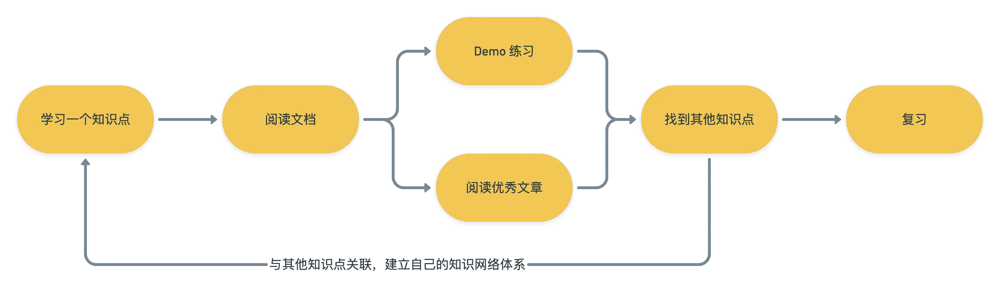
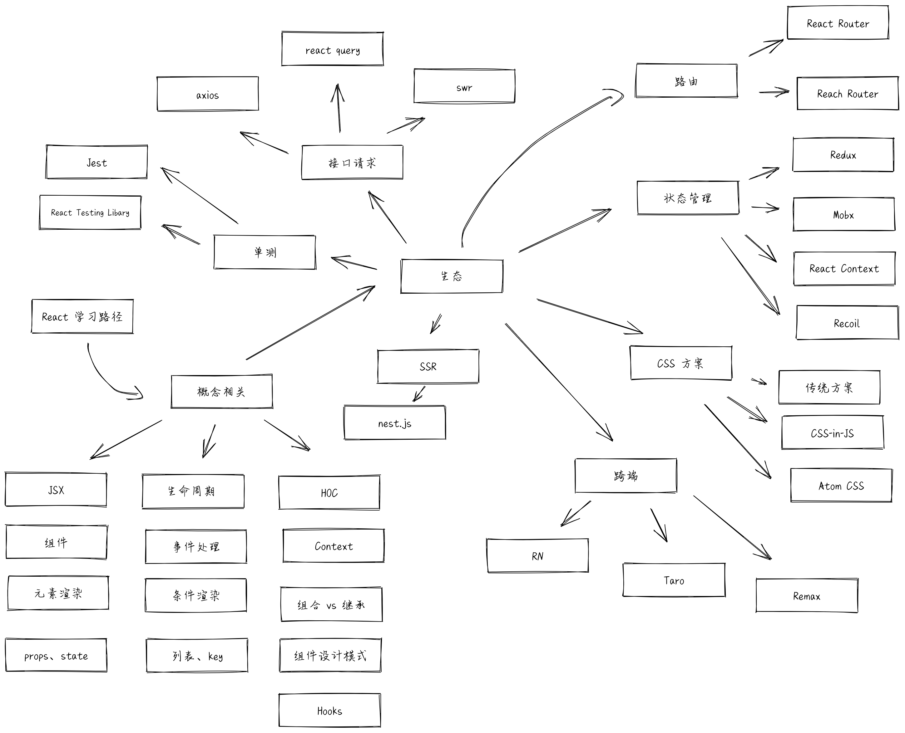

  
  
  
  
    

  

## 真全栈，全免费项目，学完直接上一个台阶

真全栈项目，适合前端进阶及转方向使用。项目包括前端、后端、Web3 最新技术栈，大杂烩，技术一锅端。

另外不是网上那些各种仿 xxx 的简单项目，尤其是后端会包括很多东西，学完直接上手做后端项目完全没问题。

教学全免费，在 B 站直播，具体内容可点击仓库查看：https://github.com/KieSun/fullstack-project。

## 🔥 这是什么？

笔者在学会 JS 以及框架的应用后，有一段时间不知道该如何深入下去，活能干，就是不知道该学啥。相信这个问题也会有很多读者朋友遇到。

当然笔者目前已经突破了这个瓶颈，也成为了知名公司基础架构组的成员。因此想通过自己成长的经历及积累的资料整理出一系列的学习路线及资料推荐，帮助各位读者朋友解决这个问题。

> 笔者会列出所有前端必学及热门领域的学习路径及推荐资料，比如浏览器、性能优化、框架、工程化、算法等等，工程浩大，大家可以持续关注该项目！

**此资料适用于小白入门、初中级进阶、高级查漏补缺。**

**内容每天都在更新，大家可以持续关注。**

## 💻 如何使用

如果你是初中级工程师来说，笔者也推荐先行学习「前端核心学习路径」，主要是巩固基础，之后再挑选感兴趣的主题。

如果你是高级工程师，笔者推荐跳过「前端核心学习路径」，直接挑选感兴趣的主题学习即可。

以下所有知识点笔者都会帮助读者朋友们将知识连贯起来，从而建立自己的知识体系而不是单独记忆松散的知识点。

**推荐大家 Star 并 Fork 本项目（点击仓库顶部右上角按钮），然后 `git clone` 到本地后从上至下逐步完成学习计划。**

## 如何获取本仓库资料

**笔者已经将仓库内容里的重要资料整理好了，还附赠了前端 10 万字的面试攻略，已经帮助上千人拿到 offer。大家可以关注公众号发送「资料」获取。**

 </img>

## 如何贡献

推荐你认为优秀或者仓库缺失的内容至正确的位置即可，另外需要附带你的推荐理由。

## 📖 目录

- [🔥 这是什么？](#-这是什么)
- [💻 如何使用](#-如何使用)
- [如何获取本仓库资料](#如何获取本仓库资料)
- [如何贡献](#如何贡献)
- [📖 目录](#-目录)
- [如何高效自学](#如何高效自学)
- [书籍推荐](#书籍推荐)
  - [初级](#初级)
  - [进阶](#进阶)
  - [高级](#高级)
- [前端核心学习路径](#前端核心学习路径)
  - [JS 核心知识点](#js-核心知识点)
    - [数据类型](#数据类型)
    - [类型判断](#类型判断)
    - [类型转换](#类型转换)
    - [this](#this)
    - [闭包](#闭包)
    - [作用域](#作用域)
    - [变量提升](#变量提升)
    - [new](#new)
    - [call、apply、bind](#callapplybind)
    - [原型](#原型)
    - [Class](#class)
    - [继承](#继承)
    - [模块化](#模块化)
    - [Promise](#promise)
    - [迭代器与生成器](#迭代器与生成器)
    - [async await](#async-await)
    - [事件循环](#事件循环)
    - [节流与防抖](#节流与防抖)
    - [柯里化](#柯里化)
    - [垃圾回收](#垃圾回收)
    - [设计模式](#设计模式)
    - [其他零散但重要的知识点](#其他零散但重要的知识点)
  - [HTML](#html)
    - [语义化](#语义化)
  - [CSS](#css)
    - [盒子模型](#盒子模型)
    - [选择器](#选择器)
    - [Flex](#flex)
    - [grid](#grid)
    - [其他](#其他)
- [框架](#框架)
  - [虚拟 DOM](#虚拟-dom)
  - [路由](#路由)
- [React](#react)
  - [React 推荐学习路径](#react-推荐学习路径)
  - [React 推荐学习资料](#react-推荐学习资料)
  - [如何编写一个组件](#如何编写一个组件)
  - [受控组件和非受控组件](#受控组件和非受控组件)
  - [高阶组件（HOC）](#高阶组件hoc)
  - [Hooks](#hooks)
  - [合成事件](#合成事件)
  - [React 路由](#react-路由)
  - [React 状态管理](#react-状态管理)
  - [React 接口请求](#react-接口请求)
  - [React SSR](#react-ssr)
  - [React 单测](#react-单测)
  - [React CSS 方案](#react-css-方案)
  - [React 原理](#react-原理)
  - [Blog 推荐](#blog-推荐)
- [Vue](#vue)
  - [Vue 推荐学习路径](#vue-推荐学习路径)
  - [Vue 推荐学习资料](#vue-推荐学习资料)
  - [Vue 原理](#vue-原理)
- [浏览器](#浏览器)
  - [架构](#架构)
  - [整体流程](#整体流程)
  - [渲染相关](#渲染相关)
  - [JS 执行机制](#js-执行机制)
  - [缓存](#缓存)
  - [Devtools](#devtools)
  - [浏览器安全](#浏览器安全)
- [性能优化](#性能优化)
  - [推荐书籍](#推荐书籍)
  - [推荐网站](#推荐网站)
  - [整体优化建议](#整体优化建议)
  - [性能指标](#性能指标)
  - [性能监控](#性能监控)
- [TypeScript](#typescript)
- [Electron](#electron)
- [组件库](#组件库)
- [微前端](#微前端)
  - [推荐学习资料](#推荐学习资料)
- [跨端框架](#跨端框架)
- [监控](#监控)
- [日常充电](#日常充电)
  - [CSS 日常充电](#css-日常充电)
- [Github 优秀学习资料](#github-优秀学习资料)
  - [JS 优秀学习资料](#js-优秀学习资料)
  - [React 优秀学习资料](#react-优秀学习资料)
  - [代码样式及安全](#代码样式及安全)
- [生产力工具](#生产力工具)
  - [流程图](#流程图)
- [作者信息](#作者信息)

## 如何高效自学

自学是每个工程师都需要掌握的一项技能。这个学习方法笔者百试百灵，学习任何技术都会用上这个思路。另外我们还能通过这个思路拓宽自己的技术栈，将各个知识联系起来建立自己的知识体系，并且通过这种学习方式学到的知识也不容易遗忘。

## 书籍推荐

以下书籍主要还是推荐了 JS 方面的，其它比如说框架、TS 等等技术会在各自章节为大家介绍。

### 初级

- [JavaScript 高级程序设计（第 4 版）](https://book.douban.com/subject/35175321/)

### 进阶

- [JavaScript 忍者秘籍（第 2 版）](https://book.douban.com/subject/30143702/)
- [你不知道的 JS 三卷](https://book.douban.com/subject/26351021/)，该书英文版是开源的，并且作者已经在写第二版，有能力阅读英文的读者推荐直接看 [原著](https://github.com/getify/You-Dont-Know-JS)

### 高级

- [JavaScript 悟道](https://book.douban.com/subject/35469273/)
- [JavaScript 语言精髓与编程实践（第 3 版）](https://book.douban.com/subject/35085910/)

**上述书籍大家可以关注【[公众号](#作者信息)】发送「资料」获取，另外还附赠了前端 10 万字的面试攻略，已经帮助上千人拿到 offer。**

## 前端核心学习路径

前端知识点很多这是公认的事情，但是我们确实没必要把所有知识都去学习，那样只会贪多嚼不烂。我们能把核心知识点、热门技术以及工作中需要用到的知识学好就已经能打败大部分前端工程师了，剩下的大家可以自行根据兴趣选择学习内容。

**但是在学习其他内容之前，笔者强烈推荐各位务必一定一定先把基础打扎实了，基础不好真的不可能把自己技术往上拔高的。**

> 为了保证大家学到的知识是正确的，下文中的文档资料笔者都使用了英文版本。因为在审核资料的过程中笔者发现不少中文文档都存在翻译错误或者过时的情况。

如果你还是一位初学者，推荐先自行完整阅读一至二本书后再按照该计划学习，因为以下计划并没有囊括 JS 的所有知识，而是列出了所有核心知识点。

关于书籍笔者推荐以下两本：

- [JavaScript 高级程序设计（第 4 版）](https://book.douban.com/subject/35175321/)
- [JavaScript 忍者秘籍（第 2 版）](https://book.douban.com/subject/30143702/)

### JS 核心知识点

#### 数据类型

JS 数据类型分为两大类及八种数据类型，注意别漏了新增的 `bigint`。

- [ ] 文档：
  - [ ] [JavaScript 数据类型和数据结构](https://developer.mozilla.org/en-US/docs/Web/JavaScript/Data_structures)

#### 类型判断

类型判断有好几种方式，分别为：

- `typeof`
- `instanceof`
- `Object.prototype.toString`
- `isXXX`，比如 `isArray`

- [ ] 文档
  - [ ] [typeof](https://developer.mozilla.org/en-US/docs/Web/JavaScript/Reference/Operators/typeof)
  - [ ] [instanceof](https://developer.mozilla.org/en-US/docs/Web/JavaScript/Reference/Operators/instanceof)
  - [ ] [Object.prototype.toString](https://developer.mozilla.org/en-US/docs/Web/JavaScript/Reference/Global_Objects/Object/toString#using_tostring_to_detect_object_class)
- [ ] 推荐文章，Issue 也挺重要
  - [ ] [JavaScript 专题之类型判断(上)](https://github.com/mqyqingfeng/Blog/issues/28)
  - [ ] [JavaScript 专题之类型判断(下)](https://github.com/mqyqingfeng/Blog/issues/30)

#### 类型转换

类型转换算是 JS 中情况繁杂且容易出错，但是开发中还经常会遇到的知识点。强行全部记忆容易遗忘，推荐记忆及练习开发中的常见情况。

- [ ] 文档
  - [ ] [ES 标准](https://tc39.es/ecma262/#sec-abstract-operations)
    - 标准并不好读，如果读者英文水平欠佳，可以只阅读该小节内的表格内容。
  - [ ] [双等判断](https://developer.mozilla.org/en-US/docs/Web/JavaScript/Reference/Operators/Equality)
- [ ] 推荐文章
  - [ ] [You Don't Know JS 书中关于类型转换的一章节](https://github.com/weiqinl/You-Dont-Know-JS-CN/blob/master/types%20%26%20grammar/ch4.md)
  - [ ] [几种基本类型简单的类型转换](https://zh.javascript.info/type-conversions)
  - [ ] [JavaScript 深入之头疼的类型转换(上)](https://github.com/mqyqingfeng/Blog/issues/159)
  - [ ] [JavaScript 深入之头疼的类型转换(下)](https://github.com/mqyqingfeng/Blog/issues/164)

#### this

`this` 算是不少初学者容易搞混的一个知识点，但是它很重要，务必掌握。

- [ ] 文档
  - [ ] [this](https://developer.mozilla.org/en-US/docs/Web/JavaScript/Reference/Operators/this)
- [ ] 推荐文章
  - [ ] [You Don't Know JS 书中关于 this 的第一章节](https://github.com/getify/You-Dont-Know-JS/blob/1st-ed/this%20%26%20object%20prototypes/ch1.md)
  - [ ] [You Don't Know JS 书中关于 this 的第二章节](https://github.com/getify/You-Dont-Know-JS/blob/1st-ed/this%20%26%20object%20prototypes/ch2.md)
  - [ ] [深入理解 js this 绑定 ( 无需死记硬背，尾部有总结和面试题解析 )](https://segmentfault.com/a/1190000011194676)

#### 闭包

闭包特别常用，但是其实挺多工程师对于闭包的理解是错误的。

- [ ] 文档
  - [ ] [闭包](https://developer.mozilla.org/en-US/docs/Web/JavaScript/Closures)
- [ ] 推荐文章
  - [ ] [You Don't Know JS 第二版中对于闭包的解释](https://github.com/getify/You-Dont-Know-JS/blob/2nd-ed/scope-closures/ch7.md)，该版本暂无中文翻译，读者可用 [DeepL](https://www.deepl.com/translator) 进行翻译。
  - [ ] [JavaScript 的静态作用域链与“动态”闭包链](https://juejin.cn/post/6957913856488243237)
  - [ ] [知乎中关于闭包的讨论](https://www.zhihu.com/question/34210214)

#### 作用域

作用域是指程序中定义变量的区域，该位置决定了变量的生命周期，也就是变量和函数的可访问范围。

- [ ] 文档
  - [ ] [作用域](https://developer.mozilla.org/en-US/docs/Glossary/Scope)
  - [ ] [块作用域](https://developer.mozilla.org/en-US/docs/Glossary/Block/Scripting)
- [ ] 推荐文章
  - [ ] [JavaScript 深入之词法作用域和动态作用域](https://github.com/mqyqingfeng/Blog/issues/3)
  - [ ] [JavaScript 深入之作用域链](https://github.com/mqyqingfeng/Blog/issues/6)
  - [ ] [Variable scope, closure](https://javascript.info/closure)，另有 [中文翻译版](https://zh.javascript.info/closure)
  - [ ] [You Don't Know JS Yet: Scope & Closures](https://github.com/getify/You-Dont-Know-JS/tree/2nd-ed/scope-closures)
  - [ ] [The battle between function scope and block scope](https://www.deadcoderising.com/2017-04-11-es6-var-let-and-const-the-battle-between-function-scope-and-block-scope/)

#### 变量提升

变量提升（Hoisting）可以将变量和函数在编译阶段放入内存，从而在执行阶段时在声明前使用。

- [ ] 文档
  - [ ] [JS 变量提升](https://developer.mozilla.org/en-US/docs/Glossary/Hoisting)，变量提升的概念
- [ ] 推荐文章
  - [ ] [JavsScript 变量提升和函数提升](https://towind.fun/2021/05/10/js-hoisting/)，深度解析变量提升和函数提升，举例说明各种情况下的变量提升
  - [ ] [我用了两个月的时间才理解 let](https://fangyinghang.com/let-in-js/)，深度理解解析 let 和 val 的区别，和 let 的暂时死区
  - [ ] [JavaScript Scoping and Hoisting](http://www.adequatelygood.com/JavaScript-Scoping-and-Hoisting.html)，JavaScript 中的作用域和函数声明和变量声明的提升

#### new

`new` 操作符可以帮助我们构建出一个实例，并且绑定上 `this`。

- [ ] 文档
  - [ ] [new](https://developer.mozilla.org/en-US/docs/Web/JavaScript/Reference/Operators/new)
- [ ] 推荐文章
  - [ ] [JS 的 new 到底是干什么的？](https://zhuanlan.zhihu.com/p/23987456)
  - [ ] [JavaScript 深入之 new 的模拟实现](https://github.com/mqyqingfeng/Blog/issues/13)

#### call、apply、bind

- [ ] 文档
  - [ ] [call](https://developer.mozilla.org/en-US/docs/Web/JavaScript/Reference/Global_Objects/Function/call)，call 的概念
  - [ ] [apply](https://developer.mozilla.org/en-US/docs/Web/JavaScript/Reference/Global_Objects/Function/apply)，apply 的概念
  - [ ] [bind](https://developer.mozilla.org/en-US/docs/Web/JavaScript/Reference/Global_Objects/Function/bind)，bind 的概念
- [ ] 推荐文章
  - [ ] [JS 中的 call、apply、bind 方法详解](https://segmentfault.com/a/1190000018270750)，对这三个方法的使用、面试题及具体实现做了详解
  - [ ] [call 和 apply 的模拟实现](https://github.com/mqyqingfeng/Blog/issues/11)，模拟实现 call 和 apply，帮助更好理解
  - [ ] [bind 的模拟实现](https://github.com/mqyqingfeng/Blog/issues/12)，模拟实现 bind，帮助更好理解

#### 原型

通过原型这种机制，JavaScript 中的对象从其他对象继承功能特性。

- [ ] 文档
  - [ ] [原型](https://developer.mozilla.org/en-US/docs/Learn/JavaScript/Objects/Object_prototypes)
- [ ] 推荐文章
  - [ ] [You Don't Know JS: this & Object Prototypes](https://github.com/getify/You-Dont-Know-JS/blob/1st-ed/this%20%26%20object%20prototypes/ch5.md)
  - [ ] [深入理解 JavaScript 原型](https://mp.weixin.qq.com/s/1UDILezroK5wrcK-Z5bHOg)
  - [ ] [深度解析原型中的各个难点](https://juejin.cn/post/6844903575974313992)
  - [ ] [Prototypes in JavaScript](https://betterprogramming.pub/prototypes-in-javascript-5bba2990e04b) 需自备梯子

#### Class

`class` 只是原型链的语法糖，与其它语言中的类不是同一样东西。

- [ ] 文档
  - [ ] [Class](https://developer.mozilla.org/en-US/docs/Glossary/Class)
- [ ] 推荐文章
  - [ ] [理解 JavaScript 的类](https://www.digitalocean.com/community/tutorials/understanding-classes-in-javascript)
  - [ ] [Babel 是如何编译 Class 上](https://github.com/mqyqingfeng/Blog/issues/105)
  - [ ] [Babel 是如何编译 Class 下](https://github.com/mqyqingfeng/Blog/issues/106)
  - [ ] [给 ES6 class 说句公道话](https://juejin.cn/post/6924108426125508616)
  - [ ] [应该在 JavaScript 中使用 Class 吗？](https://zhuanlan.zhihu.com/p/158956514)

#### 继承

继承是面向对象语言（Object-Oriented Language）三大特征之一，在 JS 中也占有非常重要的地位。而想要实现继承有多种方式，它们都有各自的优缺点。

- [ ] 文档
  - [ ] [继承](https://developer.mozilla.org/en-US/docs/Learn/JavaScript/Objects/Inheritance)
- [ ] 推荐文章
  - [ ] [JavaScript 深入之继承的多种方式和优缺点](https://github.com/mqyqingfeng/Blog/issues/16)
  - [ ] [JavaScript 中的继承](https://medium.com/@happymishra66/inheritance-in-javascript-21d2b82ffa6f)，需自备梯子
  - [ ] [JS 类继承](https://javascript.info/class-inheritance)，另有 [中文翻译版](https://zh.javascript.info/class-inheritance)

#### 模块化

这块知识必会，最好了解下模块化的前世今生以及对 ES6 的原生模块化有个深入的理解。

- [ ] 文档
  - [ ] [Modules](https://developer.mozilla.org/en-US/docs/Web/JavaScript/Guide/Modules)
- [ ] 推荐文章
  - [ ] [【深度全面】前端 JavaScript 模块化规范进化论](https://segmentfault.com/a/1190000023711059)，记录了 JS 模块化的进化之路
  - [ ] [JavaScript modules](https://v8.dev/features/modules)，由浅入深解释 JS 模块化
  - [ ] [ES modules: A cartoon deep-dive](https://hacks.mozilla.org/2018/03/es-modules-a-cartoon-deep-dive/)，一篇对 JS 模块化深入解释的文章，另有 [中文版](https://juejin.cn/post/6844903591979778061)

#### Promise

- [ ] 文档
  - [ ] [Promise](https://developer.mozilla.org/en-US/docs/Web/JavaScript/Reference/Global_Objects/Promise)
  - [ ] [Promises/A+ 规范](https://promisesaplus.com/)
- [ ] 推荐文章
- [Callbacks Vs Promises and basics of JS](https://theflyingmantis.medium.com/callbacks-vs-promises-and-basics-of-js-80d3d1515e81)，需自备梯子
- [ ] [最简实现 Promise，支持异步链式调用（20 行）](https://juejin.cn/post/6844904094079926286)
- [ ] [100 行代码实现 Promises/A+ 规范](https://mp.weixin.qq.com/s/qdJ0Xd8zTgtetFdlJL3P1g)
- [ ] Github
- [ ] [promise-fun](https://github.com/sindresorhus/promise-fun)

#### 迭代器与生成器

- [ ] 文档
  - [ ] [迭代器与生成器](https://developer.mozilla.org/en-US/docs/Web/JavaScript/Guide/Iterators_and_Generators)
- [ ] 推荐文章
  - [ ] [[译] 什么是 JavaScript 生成器？如何使用生成器？](https://juejin.cn/post/6844903616357072910)
  - [ ] [Understanding Generators in ES6 JavaScript with Examples](https://codeburst.io/understanding-generators-in-es6-javascript-with-examples-6728834016d5)，需自备梯子
  - [ ] [A Simple Guide to ES6 Iterators in JavaScript with Examples](https://codeburst.io/a-simple-guide-to-es6-iterators-in-javascript-with-examples-189d052c3d8e)，需自备梯子

#### async await

- [ ] 文档
  - [ ] [async](https://developer.mozilla.org/en-US/docs/Web/JavaScript/Reference/Statements/async_function)
  - [ ] [await](https://developer.mozilla.org/en-US/docs/Web/JavaScript/Reference/Operators/await)
- [ ] 推荐文章
  - [ ] [手写 async await 的最简实现（20 行）](https://juejin.cn/post/6844904102053281806)
  - [ ] [Babel 将 Generator 编译成了什么样子 ](https://github.com/mqyqingfeng/Blog/issues/102)

#### 事件循环

大家都知道 JS 是一门单线程的非阻塞的脚本语言。这也就意味着，代码在执行的任何时候只有一个主线程来处理所有的任务。所以弄懂事件循环机制对我们学习 JS 至关重要。

- [ ] 文档
  - [ ] [事件循环](https://developer.mozilla.org/en-US/docs/Web/JavaScript/EventLoop)
- [ ] 推荐文章
  - [ ] [这一次，彻底弄懂 JavaScript 执行机制](https://juejin.cn/post/6844903512845860872)
  - [ ] [一次弄懂 Event Loop](https://juejin.cn/post/6844903764202094606)
  - [ ] [JavaScript 的工作原理](https://blog.sessionstack.com/how-javascript-works-event-loop-and-the-rise-of-async-programming-5-ways-to-better-coding-with-2f077c4438b5)，需自备梯子，另有 [中文翻译版](https://github.com/Troland/how-javascript-works/blob/master/event-loop.md)。
- [ ] 事件循环可视化
  - [ ] [Loupe](http://latentflip.com/loupe/?code=JC5vbignYnV0dG9uJywgJ2NsaWNrJywgZnVuY3Rpb24gb25DbGljaygpIHsKICAgIHNldFRpbWVvdXQoZnVuY3Rpb24gdGltZXIoKSB7CiAgICAgICAgY29uc29sZS5sb2coJ1lvdSBjbGlja2VkIHRoZSBidXR0b24hJyk7ICAgIAogICAgfSwgMjAwMCk7Cn0pOwoKY29uc29sZS5sb2coIkhpISIpOwoKc2V0VGltZW91dChmdW5jdGlvbiB0aW1lb3V0KCkgewogICAgY29uc29sZS5sb2coIkNsaWNrIHRoZSBidXR0b24hIik7Cn0sIDUwMDApOwoKY29uc29sZS5sb2coIldlbGNvbWUgdG8gbG91cGUuIik7!!!PGJ1dHRvbj5DbGljayBtZSE8L2J1dHRvbj4%3D)

#### 节流与防抖

节流指连续触发事件的情况下，在某个时间段内，函数只会执行一次。
防抖指在事件被触发一定时间后再执行回调函数，如果在一定时间内该事件又被重复触发，则重启计时。

- [ ] 推荐文章
  - [ ] [函数防抖与函数节流](https://zhuanlan.zhihu.com/p/38313717)
  - [ ] [浅谈 JS 防抖和节流](https://segmentfault.com/a/1190000018428170)
  - [ ] [Debounce – How to Delay a Function in JavaScript](https://www.freecodecamp.org/news/javascript-debounce-example)
  - [ ] [Debouncing and Throttling in JavaScript](https://www.telerik.com/blogs/debouncing-and-throttling-in-javascript)

#### 柯里化

柯里化就是将接收多个参数的函数转换成接收一个参数的函数。

- [ ] 推荐文章
  - [ ] [柯里化（Currying）](https://zh.javascript.info/currying-partials)
  - [ ] [JavaScript 专题之函数柯里化](https://github.com/mqyqingfeng/Blog/issues/42)
  - [ ] [Understanding Currying in JavaScript](https://blog.bitsrc.io/understanding-currying-in-javascript-ceb2188c339)，需自备梯子，另有 [中文翻译版](https://www.cnblogs.com/GeniusLyzh/p/9937829.html)

#### 垃圾回收

JavaScrip 在变量被创建时分配内存，并在对象不再使用时自动释放内存，这个过程被称为垃圾回收。另外我们主要学习 V8 引擎下的垃圾回收机制。

- [ ] 文档
  - [ ] [内存管理 & 垃圾回收](https://developer.mozilla.org/en-US/docs/Web/JavaScript/Memory_Management)
- [ ] 推荐文章
  - [ ] [深入理解 Chrome V8 垃圾回收机制](https://github.com/yacan8/blog/issues/33)，该文章的参考文献也可阅读下
  - [ ] [GC in v8](https://github.com/lrlna/sketchin/blob/master/guides/garbage-collection-in-v8.md)
  - [ ] [JavaScript 工作原理：内存管理 + 处理常见的 4 种内存泄漏](https://blog.sessionstack.com/how-javascript-works-memory-management-how-to-handle-4-common-memory-leaks-3f28b94cfbec)，另有[中文版](https://juejin.cn/post/6844903519078580238)

#### 设计模式

- [ ] 文档
  - [ ] [wikipedia](https://en.wikipedia.org/wiki/Software_design_pattern)
  - [ ] [中文版维基百科](<https://zh.wikipedia.org/wiki/%E8%AE%BE%E8%AE%A1%E6%A8%A1%E5%BC%8F_(%E8%AE%A1%E7%AE%97%E6%9C%BA)>)
- [ ] 推荐书籍
  - [ ] 《Head First Design Pattern》 也有中文版的
  - [ ] 《Design Patterns: Elements of Reusable Object-Oriented Software》 设计模式：可复用面向对象软件的基础

#### 其他零散但重要的知识点

- [ ] [0.1 + 0.2 !== 0.3](https://zhuanlan.zhihu.com/p/225490777)，JS 浮点数会造成的问题

### HTML

#### 语义化

html 语义化就是让页面的内容结构化，便于对浏览器、搜索引擎解析。在没有引入样式 CCS 样式的时候也能以一种可以分辨出来大致表示内容的文档格式显示，并且是容易阅读的。 搜索引擎的爬虫依赖于标记来确定上下文和各个关键字的权重，利于 SEO。 使阅读源代码的人对网站更容易将网站分块，便于阅读维护理解。

- [ ] 文档
  - [ ] [HTML 中的语义](https://developer.mozilla.org/en-US/docs/Glossary/Semantics#semantics_in_html)，什么是 HTML 语义化，HTML 语义化有什么好处
- [ ] 推荐文章
  - [ ] [IFE-NOTE：页面结构语义化](https://rainylog.com/post/ife-note-1/)，HTML5 语义化中的页面结构语义化的一些经验和理解
  - [ ] [关于 HTML 语义和前端架构](http://nicolasgallagher.com/about-html-semantics-front-end-architecture/)，HTML 语义化在开发中配合 CSS 结构化类名的使用构建可重用和可组合的组件

### CSS

- [ ] 推荐文章
  - [ ] [一文梳理 CSS 必会知识点](https://juejin.cn/post/6854573212337078285)

#### 盒子模型

在 CSS 中，所有的元素都被一个个的“盒子（box）”包围着，我们广泛地使用两种“盒子” —— 块级盒子 (block box) 和 内联盒子 (inline box)，理解这些“盒子”的基本原理，是我们使用 CSS 实现准确布局、处理元素排列的关键。

- [ ] 文档
  - [ ] [CSS 盒子模型](https://developer.mozilla.org/en-US/docs/Learn/CSS/Building_blocks/The_box_model)，官方文档深入了解 CSS 盒子模型
- [ ] 推荐文章
  - [ ] [CSS 盒模型之内边距、边框、外边距 十九问](https://juejin.cn/post/6880111680153059341)，通过举例说明盒子模型各种常见形态和问题
  - [ ] [CSS Box Model](https://www.w3.org/TR/css-box-3/)，盒子模型的一些规范介绍
  - [ ] [CSS 盒模型详解（图文教程）](https://www.cnblogs.com/qianguyihao/p/7256371.html)，通过图片和例子说明盒子模型的各个部分和在页面上的表现形式

#### 选择器

CSS 中，选择器用来指定网页上我们想要样式化的 HTML 元素。CSS 选择器提供了很多种方法，所以在选择要样式化的元素时，我们可以做到很精细的地步。

CSS 选择器是 CSS 规则的第一部分。它是元素和其他部分组合起来告诉浏览器哪个 HTML 元素应当是被选为应用规则中的 CSS 属性值的方式。选择器所选择的元素，叫做“选择器的对象”。

- [ ] 文档
  - [ ] [CSS 选择器](https://developer.mozilla.org/en-US/docs/Learn/CSS/Building_blocks/Selectors)，官方文档详细地讲授选择器的不同使用方式，并了解它们的工作原理。
- [ ] 推荐文章
  - [ ] [30 个你必须熟记的 CSS 选择器](https://code.tutsplus.com/zh-hans/tutorials/the-30-css-selectors-you-must-memorize--net-16048)，开发中常用的 CSS 选择器，熟练掌握以后可以很大程度提高 CSS 的编码体验
  - [ ] [深入解析 CSS 样式优先级](https://cloud.tencent.com/developer/article/1545341)，详细介绍了 CSS 样式的权重优先级，避免写重复样式和样式被覆盖不生效的问题

#### Flex

- [ ] 文档
  - [ ] [flexbox](https://developer.mozilla.org/en-US/docs/Web/CSS/CSS_Flexible_Box_Layout/Basic_Concepts_of_Flexbox)
- [ ] 推荐文章
  - [ ] [A Complete Guide to Flexbox](https://css-tricks.com/snippets/css/a-guide-to-flexbox/)
  - [ ] [Flexbox 布局中不为人知的细节](https://juejin.cn/post/6938292463605907492)
- [] 实战
  - [ ] [FLEXBOX FROGGY](https://flexboxfroggy.com/) 一个趣味性小游戏学习 Flex 的网站

#### grid

- [ ] 文档
  - [ ] [grid](https://developer.mozilla.org/en-US/docs/Web/CSS/CSS_Grid_Layout/Basic_Concepts_of_Grid_Layout)
- [ ] 推荐文档
  - [ ] [A Complete Guide to Grid](https://css-tricks.com/snippets/css/complete-guide-grid/)
  - [ ] [最强大的 CSS 布局 —— Grid 布局](https://juejin.cn/post/6854573220306255880)

#### 其他

- [ ] 推荐文档
  - [ ] [详谈层合成（composite)](http://jartto.wang/2017/09/29/expand-on-performance-composite/)
  - [ ] [移动设备如何实现真正 1px 的线？](https://jinlong.github.io/2015/05/24/css-retina-hairlines/)

## 框架

框架一般选其一深入学习即可。

### 虚拟 DOM

Virtual DOM 也就是虚拟节点。通过 JS 的 Object 对象模拟 DOM 中的真实节点对象，再通过特定的 render 方法将其渲染成真实的 DOM 节点。

- 文档
  - [React 官网介绍](https://reactjs.org/docs/faq-internals.html)
- 推荐文章
  - [ Virtual Dom 和 Diff 算法在 React 中是如何工作的？](https://medium.com/@gethylgeorge/how-virtual-dom-and-diffing-works-in-react-6fc805f9f84e)，需自备梯子
  - [ React 核心知识点 -- Virtual Dom 与 Diff ](https://github.com/pfan123/Articles/issues/62)

### 路由

路由在 SPA 架构中都有被用到，实际原理就是运用 `hash` 及 `history` 相关的 API 实现。

- 文档
  - [hashchange](https://developer.mozilla.org/en-US/docs/Web/API/Window/hashchange_event)
  - [history](https://developer.mozilla.org/en-US/docs/Web/API/History)
- 推荐文章
  - [前端路由简介以及 vue-router 实现原理](https://zhuanlan.zhihu.com/p/37730038)，对前端路由及 Vue-Route 库原理做了解释，**几个框架的路由库原理都一致**

## React

学习框架务必从[文档](https://reactjs.org/)出发，起码熟读一遍及自己写过一些初步的 Demo 之后再考虑学习别的资料。

### React 推荐学习路径

大家可以跟着以上学习路径学习，其中除了概念相关的内容是必须学习之外，生态相关的内容大家可以在使用时再学习。

### React 推荐学习资料

- [React 学习之道](https://leanpub.com/the-road-to-learn-react-chinese/)，可以 0 元购买
- [React 生命周期](https://projects.wojtekmaj.pl/react-lifecycle-methods-diagram/)

### 如何编写一个组件

- 文档
  - [React 官方文档](https://reactjs.org/docs/components-and-props.html)
- 推荐文章
  - [[译]React 函数组件和类组件的差异](https://jishuin.proginn.com/p/763bfbd4cad4)
  - [寫 React Components 該注意的 6 個地方與技巧](https://medium.com/@chihsuan/%E5%AF%AB-react-components-%E8%A9%B2%E6%B3%A8%E6%84%8F%E7%9A%846%E5%80%8B%E5%9C%B0%E6%96%B9%E8%88%87%E6%8A%80%E5%B7%A7-faa2bb87a18e)
  - [编写高效且可读组件的 5 个最佳实践](https://www.infoq.cn/article/ry4icky5crb1pokvi0ql)
  - [designing-react-components-best-practices](https://www.thisdot.co/blog/designing-react-components-best-practices)
  - [React 复合组件](https://www.smashingmagazine.com/2021/08/compound-components-react/)

### 受控组件和非受控组件

- 受控组件：在 HTML 中，表单元素（如 input、 textarea 和 select ）通常自己维护 state，并根据用户输入进行更新。而在 React 中，可变状态（mutable state）通常保存在组件的 state 属性中，并且只能通过使用 setState() 或者 props 来更新
- 非受控组件：是一个存储其自己的内部状态，并且您使用查询 DOM ref，当你需要它来找到它的当前值，这有点像传统的 HTML

- 文档
  - [React 官方文档](https://reactjs.org/docs/uncontrolled-components.html)
- 推荐文章
  - [受控和非受控组件真的那么难理解吗](https://juejin.cn/post/6858276396968951822)
  - [[译]受控组件 & 非受控组件](https://www.baobangdong.cn/controlled-components-and-uncontrolled-components/)

### 高阶组件（HOC）

高阶组件（HOC）是 React 中用于复用组件逻辑的一种高级技巧。HOC 自身不是 React API 的一部分，它是一种基于 React 的组合特性而形成的设计模式。

具体而言，高阶组件是参数为组件，返回值为新组件的函数。

- 文档
  - [React 官方文档](https://reactjs.org/docs/higher-order-components.html)
- 推荐文章
  - [React 高阶组件(HOC)入门指南](https://github.com/MrErHu/blog/issues/4)
  - [hoc 库 recompose](https://github.com/acdlite/recompose)
  - [精读 React 高阶组件](https://zhuanlan.zhihu.com/p/27434557)

### Hooks

Hook 是 React 16.8 的新增特性。它可以让你在不编写类组件的情况下使用 React 的特性。

- 文档
  - [React Hooks 官方文档](https://zh-hans.reactjs.org/docs/hooks-intro.html)
- 推荐文章
  - [彻底理解 React hook useCallback 和 useMemo 的区别](https://juejin.cn/post/6844904032113278990)
  - [React hooks 最佳实践](https://mp.weixin.qq.com/s/0sykIHDM_Ih3W3md-DwFkw)

### 合成事件

合成事件（SyntheticEvent）是 React 模拟原生 DOM 事件所有能力的一个事件对象，即浏览器原生事件的跨浏览器包装器。React 根据 [W3C 规范](https://www.w3.org/TR/DOM-Level-3-Events/) 定义了合成事件。需要注意的是 v16 和 17 版本中的合成事件有差异。

- 文档
  - [React 官方文档](https://reactjs.org/docs/events.html)
- 推荐文章
  - [探索 React 合成事件](https://segmentfault.com/a/1190000038251163)
  - [大佬，怎么办？升级 React17，Toast 组件不能用了](https://zhuanlan.zhihu.com/p/380941094)
  - [What’s the Difference Between Synthetic React Events and JavaScript Events?](https://betterprogramming.pub/whats-the-difference-between-synthetic-react-events-and-javascript-events-ba7dbc742294)，需自备梯子
  - [React 17 removes event pooling in the modern browsers](https://blog.saeloun.com/2021/04/06/react-17-removes-event-pooling-in-modern-system.html)

### React 路由

- [react-router](https://github.com/remix-run/react-router)，React 声明式路由
- [reach router](https://github.com/reach/router)，下一代的 React 路由

### React 状态管理

React 状态管理可谓百花齐放百家争鸣，远远不止笔者列的这些库。但是实际上很多项目完全是不需要用到状态管理的，反而是增加编码复杂度，其实利用 React Context 或者 [react-query](https://github.com/tannerlinsley/react-query) 这类接口请求库就能很好地满足需求了。

- [redux](https://github.com/reduxjs/redux)，JS 应用的状态容器，提供可预测的状态管理
- [mobx](https://github.com/mobxjs/mobx)，简单，可扩展的状态管理库
- [recoil](https://github.com/facebookexperimental/Recoil)，React 状态管理库
- [xstate](https://github.com/statelyai/xstate)，有限状态机
- [zustand](https://github.com/pmndrs/zustand)，简单、快速和可扩展的骨状态管理解决方案

### React 接口请求

- [axios](https://github.com/axios/axios)，传统接口请求库
- [react-query](https://github.com/tannerlinsley/react-query)，用于获取、缓存和更新 React 中异步数据的 Hooks 接口请求库
- [swr](https://github.com/vercel/swr)，用于数据请求的 React Hooks 库

### React SSR

- [nest.js](https://github.com/nestjs/nest)，一个渐进式的 Node.js 框架，用于构建高效、可靠和可扩展的服务端应用。

### React 单测

- [jest](https://github.com/facebook/jest)，优雅、简洁的 JavaScript 测试框架，单测必选项
- [react-testing-library](https://github.com/testing-library/react-testing-library)，简单且完整的 React DOM 测试工具

### React CSS 方案

- [styled-components](https://github.com/styled-components/styled-components)，CSS in JS 方案
- [tailwindcss](https://github.com/tailwindlabs/tailwindcss)，Atom CSS 方案

### React 原理

- [react-source-code-debug](https://github.com/neroneroffy/react-source-code-debug)，学习如何调试源码
- [react-illustration-series](https://github.com/7kms/react-illustration-series)，图解 react 源码，用大量配图的方式，致力于将 react 原理表述清楚
- [just-react](https://github.com/BetaSu/just-react)，「React 技术揭秘」，一本自顶向下的 React 源码分析书
- [tiny-react](https://github.com/PiNengShaoNian/tiny-react)，基于 React17 精简而来的最小版实现

### Blog 推荐

- [Dan Abramov](https://overreacted.io/)，React 核心开发者的 Blog

## Vue

学习框架务必从[文档](https://vuejs.org/)出发，起码熟读一遍及自己写过一些初步的 Demo 之后再考虑学习别的资料。

对于 Vue 来说，官方文档内容相当齐全，并且全家桶也都是官方出的，因此无需头疼技术栈选型。

### Vue 推荐学习路径

目前 3.0 生态并不完善，在公司内部基本需要先熟悉 2.0 的写法，因此推荐新手先学习 2.0 的内容。

- [新手向：Vue 2.0 的建议学习顺序](https://zhuanlan.zhihu.com/p/23134551)，尤雨溪自己写的学习路径，时至今日也不过时

### Vue 推荐学习资料

- [ ] [awesome-vue](https://github.com/vuejs/awesome-vue)
- [ ] [vue-patterns](https://github.com/learn-vuejs/vue-patterns)，有用的 Vue 模式、技巧、提示以及有帮助的精选链接

### Vue 原理

- [vue-analysis](https://github.com/ustbhuangyi/vue-analysis)，黄老师出品
- [vue-design](https://github.com/HcySunYang/vue-design)，官方人员出品，域名已过期，需要大家自行在仓库内浏览内容。虽然麻烦了点，但是质量绝对过关

## 浏览器

一般说到浏览器，常指的都是 Chrome。浏览器作为前端不可或缺的载体，我们势必需要好好学习及掌握其相关的知识。

**另外浏览器中涉及到的知识面很多，与 JS 执行机制、网络、性能优化、安全等领域都有关联，因此大家在学习这部分的内容时需要多与之前学习的知识联系起来。**

### 架构

- [Inside look at modern web browser](https://developers.google.com/web/updates/2018/09/inside-browser-part1)，这是一个 Google 出的系列专栏，共有四篇文章，内容上到浏览器的整体架构，下至页面的渲染规则都说了一遍，另有 [中文翻译](https://cloud.tencent.com/developer/article/1806716)

### 整体流程

- [浏览器的工作原理：新式网络浏览器幕后揭秘](https://www.html5rocks.com/zh/tutorials/internals/howbrowserswork/)，这虽然是一篇 11 年的文章，但是内容在如今也不过时，文章广为流传
- [当···时发生了什么？](https://github.com/skyline75489/what-happens-when-zh_CN)，经典面试题，文中对于这个流程里的相关内容力求尽可能具体，不遗漏任何细节
- [从输入 URL 到页面加载完成的过程中都发生了什么事情？](https://fex.baidu.com/blog/2014/05/what-happen/)，这篇文章涉及了大量网络及硬件知识

### 渲染相关

- [浏览器的渲染原理简介](https://coolshell.cn/articles/9666.html)，左耳朵耗子出品，如果上文「浏览器的工作原理：新式网络浏览器幕后揭秘」觉得太长不看或者看完觉得没看懂什么，那么可以来阅读下本文，起码能从中学会一些能用在工作上的东西
- [浏览器的回流与重绘 (Reflow & Repaint)](https://juejin.cn/post/6844903569087266823)

### JS 执行机制

- [从浏览器多进程到 JS 单线程，JS 运行机制最全面的一次梳理](https://segmentfault.com/a/1190000012925872)，超长文，这篇文章能让你对进程线程，浏览器多进程、浏览器内核多线程、JS 单线程、JS 运行机制有个不错的理解

### 缓存

- [文档](https://developer.mozilla.org/zh-CN/docs/Web/HTTP/Caching)
- [彻底理解浏览器的缓存机制](https://juejin.cn/post/6844903593275817998)，浏览器缓存机制与性能优化息息相关
- [图解 Http 缓存控制之 max-age=0、no-cache、no-store 区别](https://zhuanlan.zhihu.com/p/55623075)，很有趣的图解文章

### Devtools

- [Chrome DevTools](https://developer.chrome.com/docs/devtools/)，Google 出的 DevTools 的使用说明书，对于每个功能的使用都有详细的介绍，看啥文章都不如看这个
- [Chrome_Devtools_Tricks](https://github.com/dendoink/FrontendWingman/tree/master/Chrome_Devtools_Tricks)，介绍了 Chrome DevTools 的使用技巧，从不同的情景来说明应该如何搭配使用 Chrome DevTools 中的小技巧，适合英文不怎么好的读者阅读

### 浏览器安全

- [文档](https://developer.mozilla.org/en-US/docs/Web/Security)
- [一文读懂 Web 安全](https://segmentfault.com/a/1190000023396707)，简单介绍了一些前端需要注意的安全知识
- [the-book-of-secret-knowledge](https://github.com/trimstray/the-book-of-secret-knowledge)，如果你对安全领域有兴趣，可以阅读下这个仓库的内容

## 性能优化

性能优化是一个系统性工程，涉及到的方面很多，不仅仅只是大家常说的静态文件和代码优化那么简单。

大家学习这部分内容的时候可以先从推荐的文章中了解具体有哪些性能优化手段及具体方法，然后根据这些内容去实验。

### 推荐书籍

其实性能优化相关的书籍市面上出的不多，优秀的也都是好几年前的老书了，看不看也无所谓了。

- [Web 性能权威指南](https://book.douban.com/subject/25856314/)，豆瓣 8.9 分，老书
- [高性能网站建设进阶指南](https://book.douban.com/subject/4719162/)，豆瓣 8.9 分，老书

### 推荐网站

- [web.dev](https://web.dev/)，Google 自家的 blog，你能在这上面学到很多性能优化及如何做好用户体验的知识，其实很多市面上的文章内容都有这个网站的影子

### 整体优化建议

- [前端性能优化 24 条建议（2020）](https://juejin.cn/post/6892994632968306702)，类似现代版雅虎军规
- [前端性能优化之旅](https://github.com/alienzhou/fe-performance-journey)，系统性介绍性能优化的手段，参考资料也值得学习
- [Front-End Performance Checklist 2021](https://www.smashingmagazine.com/2021/01/front-end-performance-2021-free-pdf-checklist/)，一本很火的免费 PDF，包含了很多性能优化相关的 Checklist
- [React 性能优化 | 包括原理、技巧、Demo、工具使用](https://juejin.cn/post/6935584878071119885)

### 性能指标

- [文档](https://web.dev/learn-web-vitals/)
- [还在看那些老掉牙的性能优化文章么？这些最新性能指标了解下](https://juejin.cn/post/6850037270729359367)，文章会介绍谷歌提倡的七个用户体验指标（也可以认为是性能指标）
- [做性能优化时，我们关注哪些指标？](https://mp.weixin.qq.com/s/SlS0J9eSb20PCLW062sQVg)

### 性能监控

- [前端搞工程化：从零打造性能检测库「源码 + 视频」](https://juejin.cn/post/6919295789630455815)，光会性能优化的手段还是不够的，如何体现优化的价值也是至关重要的

## TypeScript

TypeScript 是为开发大型应用而设计的，并且 TypeScript 可转译成 JavaScript。由于 TypeScript 是 JavaScript 的严格超集，任何现有的 JavaScript 程序都是合法的 TypeScript 程序。

文档

- [TypeScript 官方文档](https://www.typescriptlang.org/docs/)

推荐文章

- [TypeScript 入门教程](https://ts.xcatliu.com/)
- [TypeScript 的另一面：类型编程](https://juejin.cn/post/6989796543880495135)
- [TypeScript Deep Dive](https://basarat.gitbook.io/typescript/) 另有[中文版](https://jkchao.github.io/typescript-book-chinese/)

推荐开源项目

- [TypeScript-for-Beginner-Programmers](https://github.com/chibicode/TypeScript-for-Beginner-Programmers) 需自备梯子
- [type-challenges](https://github.com/type-challenges/type-challenges)
- [TypeScript exercises](https://github.com/typescript-exercises/typescript-exercises)

## Electron

Electron 是一个可以使用 Web 技术如 JavaScript、HTML 和 CSS 来创建跨平台原生桌面应用的框架。借助 Electron，我们可以使用纯 JavaScript 来调用丰富的原生 APIs。

文档

- [Electron 官网](https://www.electronjs.org/)
- [Electron 中文教程](https://weishuai.gitbooks.io/electron-/content/)

推荐文章

- [分享这半年的 Electron 应用开发和优化经验](https://juejin.cn/post/6844904029231775758)
- [用 JS 开发跨平台桌面应用，从原理到实践](https://juejin.cn/post/6844903862302670862)
- [Building a desktop application with Electron](https://medium.com/developers-writing/building-a-desktop-application-with-electron-204203eeb658) 需翻墙访问

推荐开源项目

- [Electron 资源](https://github.com/sindresorhus/awesome-electron)
- [Electron Playground](https://github.com/tal-tech/electron-playground)
- [electron-vue-cloud-music](https://github.com/xiaozhu188/electron-vue-cloud-music)
- [electron-builder](https://github.com/electron-userland/electron-builder)

## 组件库

组件库顾名思义指的就是将多个公共模块或者可复用的组件提取整合生成的一个仓库

知名度较广的组件库：

- [antd](https://github.com/ant-design/ant-design.git)
- [elementUI](https://github.com/ElemeFE/element.git)

相关文档：

- [lerna](https://github.com/lerna/lerna)
- [angular commit 规范](https://github.com/angular/angular/blob/master/CONTRIBUTING.md#commit)
- [yarn](https://yarnpkg.com/)
- [css variables](https://developer.mozilla.org/en-US/docs/Web/CSS/Using_CSS_custom_properties)

推荐文章：

- [从 0 到 1，搭建一个体系完善的前端 React 组件库](https://www.infoq.cn/article/i4q9ybdmxzmu8eex8qvh)
- [如何规范你的 Git commit？](https://zhuanlan.zhihu.com/p/182553920)
- [基于 lerna 和 yarn workspace 的 monorepo 工作流](https://zhuanlan.zhihu.com/p/71385053)
- [FusionNext 可配置能力从 Sass 体系升级为支持 Css Variable](https://zhuanlan.zhihu.com/p/257159028)

## 微前端

是一种类似于微服务的架构，它将微服务的理念应用于浏览器端，即将单页面前端应用由单一的单体应用转变为多个小型前端应用聚合为一的应用。

优势：

- 代码库更小，更内聚、可维护性更高
- 松耦合、自治的团队可扩展性更好
- 渐进地升级、更新甚至重写部分前端功能成为了可能
- 独立开发部署，缩小变更范围，进而降低相关风险

框架：

- [single-spa](https://single-spa.js.org/)
- [蚂蚁-乾坤](https://github.com/umijs/qiankun)
- [淘系-icestark](https://github.com/ice-lab/icestark)
- [字节-Garfish](https://github.com/modern-js-dev/garfish)
- [京东-micro-app](https://github.com/micro-zoe/micro-app)
- [Bit](https://bit.dev)
- [EMP - Micro Frontends solution](https://github.com/efoxTeam/emp) 基于 webpack 5 & module federation

推荐文章：

- [从零到一实现企业级微前端框架，保姆级教学](https://juejin.cn/post/7004661323124441102)
- [字节跳动是如何落地微前端的](https://mp.weixin.qq.com/s/L9wbfNG5fTXF5bx7dcgj4Q)
- [What Are Micro Frontends?](https://livebook.manning.com/book/micro-frontends-in-action/chapter-1/v-4/)
- [Bifrost 微前端框架及其在美团闪购中的实践](https://tech.meituan.com/2019/12/26/meituan-bifrost.html)
- [每日优鲜供应链前端团队微前端改造](https://juejin.cn/post/6844903943873675271)
- [微前端在美团外卖的实践](https://tech.meituan.com/2020/02/27/meituan-waimai-micro-frontends-practice.html)
- [How We Build Micro Frontends](https://blog.bitsrc.io/how-we-build-micro-front-ends-d3eeeac0acfc)
- [Revolutionizing Micro Frontends with Webpack 5, Module Federation and Bit](https://blog.bitsrc.io/revolutionizing-micro-frontends-with-webpack-5-module-federation-and-bit-99ff81ceb0)
- [万字长文+图文并茂+全面解析微前端框架 qiankun 源码](https://github.com/a1029563229/blogs/blob/master/Source-Code/qiankun/1.md)

### 推荐学习资料

- ，🔥 关于微前端的各类资料推荐

## 跨端框架

跨端的最主要的含义就是一套代码多端运行，减少重复劳动

目前看来，国内比较流行的是小程序, H5, App 三端跨的框架， [uniapp](https://github.com/dcloudio/uni-app) 及 [taro](https://github.com/NervJS/taro) 是其中做的比较出彩的两个框架。当然在 taro3.0 之前（以下主要是说小程序），taro 跟 uniapp 都是使用编译时做更多的事情，编译成小程序能够运行的代码。

而在 taro3.0 之后变成了与 [remax](https://github.com/remaxjs/remax) 相同的思想，在运行时做更多的事情，保证了原框架代码能够完全使用，而不需要为了转换成其他小程序时做兼容。

- [awesome-remax](https://github.com/remaxjs/awesome-remax)
- [美团自研 react 跨端](https://tech.meituan.com/2021/06/10/react-native-hybrid-practice-dsl-in-meituan.html)
- [京东 taro](https://juejin.cn/post/6844904036743774216)

## 监控

当业务进入稳定，最需要做的肯定是对于业务线上的各种性能、异常及常规业务进行监控，避免在上线之后成为瞎子。

目前市场比较出名的监控系统：

- [sentry](https://sentry.io/welcome/)
- [ali node](https://www.aliyun.com/product/nodejs)
- [bugly](https://bugly.qq.com/v2/)
- [mixpanel](https://mixpanel.com/)
- [听云](https://www.tingyun.com/)

推荐开源库：

- [rrweb](https://github.com/rrweb-io/rrweb)，提供像素级的录制与回放，帮助正确定位问题是如何发生的
- [monitor](https://github.com/clouDr-f2e/monitor)，👀 一款轻量级的收集页面的用户点击行为、路由跳转、接口报错、代码报错、并上报服务端的 SDK
- [mitojs](https://github.com/mitojs/mitojs) 上面 `monitor` 作者新维护的库。全新插拔式的监控 SDK，代码架构更清晰，配置项更丰富，高度可定制化

推荐文章：

- [美团可视化埋点方案](https://tech.meituan.com/2019/08/15/mtflexbox-automation-buried-point-exploration.html)
- [如何进行 web 性能监控？](http://www.alloyteam.com/2020/01/14184/#prettyPhoto)
- [蚂蚁金服如何把前端性能监控做到极致?](https://www.infoq.cn/article/dxa8am44oz*lukk5ufhy)
- [如何做前端异常监控？](https://www.zhihu.com/question/29953354)
- [前端监控平台系列：JS SDK（已开源）](https://juejin.cn/post/6862559324632252430#heading-17)
- [前端监控 SDK 的一些技术要点原理分析](https://juejin.cn/post/7017974567943536671?utm_source=gold_browser_extension)

## 日常充电

- [Best-websites-a-programmer-should-visit](https://github.com/sdmg15/Best-websites-a-programmer-should-visit)，优秀的工程师都应该阅读的网站

### CSS 日常充电

- [You-need-to-know-css](https://github.com/l-hammer/You-need-to-know-css)
- [CSS Inspiration](https://csscoco.com/inspiration/#/)
- [CSS Tricks](https://qishaoxuan.github.io/css_tricks/)
- [spinkit](https://tobiasahlin.com/spinkit/) 需自备梯子
- [animista](https://animista.net/)

## Github 优秀学习资料

### JS 优秀学习资料

- [33-js-concepts](https://github.com/leonardomso/33-js-concepts)
- [JavaScript 安全指南](https://github.com/Tencent/secguide/blob/main/JavaScript%E5%AE%89%E5%85%A8%E6%8C%87%E5%8D%97.md#1.1)
- [What the f\*ck JavaScript?](https://github.com/denysdovhan/wtfjs)，有趣的 JavaScript 示例列表，附有解释
- [clean-code-javascript](https://github.com/ryanmcdermott/clean-code-javascript)，适应于 JavaScript 的优雅代码建议

### React 优秀学习资料

- [react-philosophies](https://github.com/mithi/react-philosophies)，React 哲学，内容为写 React 代码时思考的事情

### 代码样式及安全

- [secguide](https://github.com/Tencent/secguide)，面向开发人员梳理的代码安全指南

## 生产力工具

### 流程图

- [whimsical](https://whimsical.com/)

## 作者信息

| 微信扫码关注公众号，订阅更多精彩内容                                                                 | 加笔者微信进群与大厂大佬讨论技术                                                                    |
| ---------------------------------------------------------------------------------------------------- | --------------------------------------------------------------------------------------------------- |
|  |  |
